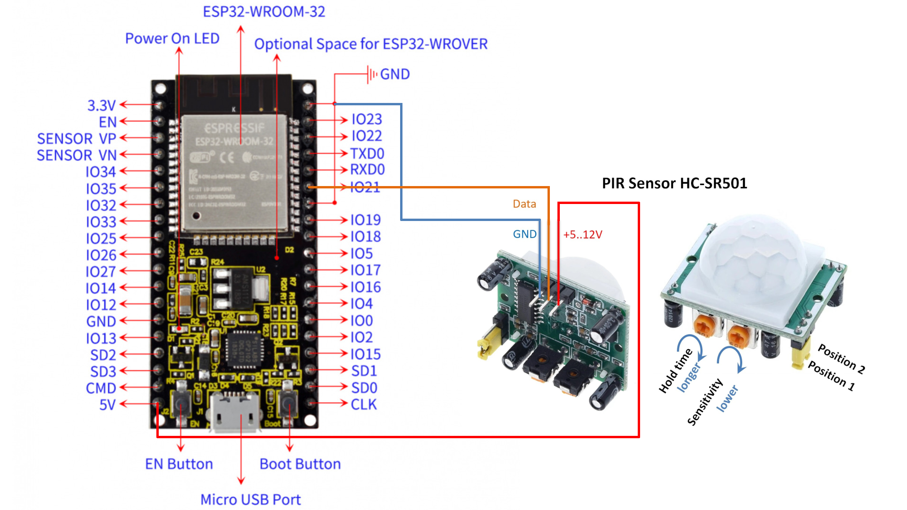

# MQTT Sender

This project is an MQTT client based on ESP32 that connects to a WiFi network, sets time via NTP servers, read data from PIR sensor and publishes the data to an MQTT broker.

## Features

- Connects to WiFi networks.
- Reads data from a PIR sensor to detect human presence.
- Retrieves time using NTP.
- Uses `ArduinoJson` for handling JSON data.
- Publishes to MQTT topics.

## Requirements

- **Hardware:** ESP32 (or compatible), PIR motion sensor.
- **Arduino Libraries:**
  - `WiFi.h`
  - `PubSubClient.h`
  - `ArduinoJson.h`

## Installation and Usage

1. **Configure credentials:** Edit the `mqtt_sender.ino` file and replace the values in the corresponding variables:
   ```cpp
   const char* ssid = "YOUR_SSID";
   const char* wifi_password = "YOUR_PASSWORD";
   const char* mqtt_server = "BROKER_ADDRESS";
   const char* mqtt_usr = "MQTT_USERNAME";
   const char* mqtt_pwd = "MQTT_PASSWORD";
   const char* mqtt_topic = "PUBLISH_TOPIC";
   const char* mqtt_control_topic = "CONTROL_TOPIC";
   ```
2. **Connect the PIR sensor:** Wire the PIR sensor to the ESP32, ensuring the signal pin is correctly assigned in the code.
3. **Upload the code to the ESP32:** Use the Arduino IDE or PlatformIO to compile and upload the code.
4. **Monitor the ESP32:** You can use the Serial Monitor (115200 baud) to check the connection and messages sent.

## MQTT Usage

- **Publishing Messages:** The ESP32 will send data in JSON format to `mqtt_topic`, including human presence detected by the PIR sensor.

## Wiring diagram


## Notes

- Ensure your MQTT broker is online and accessible.
- You can use tools like `MQTT Explorer` or `mosquitto_sub` to debug and view the sent messages.
- The PIR sensor's sensitivity and delay settings may need adjustment for optimal detection.

